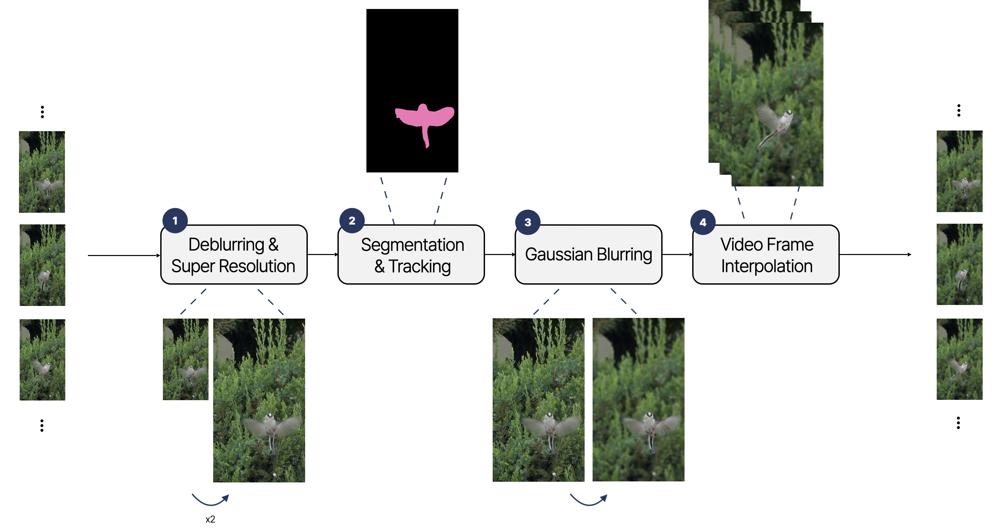

# '24s Vision Application - Team ViP

<h3> 새 추적 60분 </h3>

[Yejin Kim](https://github.com/Jin1025)1
, [Sumin Cho](https://github.com/rillbrill)2
, [Wooryeon Lee](https://github.com/dnflslwlq)3
, and [Jaeung Lee](https://github.com/gnueaj) 4&dagger;
 
1Konkuk University&emsp;
2Hongik University&emsp;
3Hanyang University&emsp;
4Sungkyunkwan University 
 
&nbsp;
 
 
포커싱 전환 및 비디오 프레임 보간을 통한 시네마틱 슬로우모션 제작  

